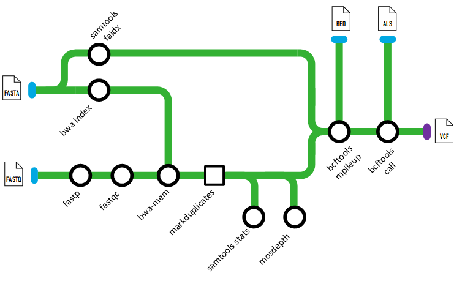

[](https://www.nextflow.io/)
[](https://www.docker.com/)

# tetris


## Introduction

**tetris** is a nextflow pipeline for processing short read DNA sequencing data and calling variants.

It trims reads with ([`fastp`](https://github.com/OpenGene/fastp)), aligns with ([`BWA-MEM`](https://bio-bwa.sourceforge.net/)), marks duplicates (optional) with ([`GATK MarkDuplicates`](https://gatk.broadinstitute.org/hc/en-us/articles/21905036102043-MarkDuplicates-Picard)), and calls variants with ([`BCFTOOLS`](https://www.htslib.org/)). Additionally QC stats are computed with ([`FastQC`](https://www.bioinformatics.babraham.ac.uk/projects/fastqc/)), ([`Samtools`](https://www.htslib.org/)) and ([`mosdepth`](https://github.com/brentp/mosdepth)) which is aggregated into a report by ([`MultiQC`](http://multiqc.info/))




## Input Requirements:
The pipeline expects a CSV samplesheet as input, which should contain the sample name, sequence id, read type (single/paired) and the path to the read1 fastq file and path to the read2 fastq file (optional). It should look something similar to:

```csv
name,seqid,seq_type,fastq_1,fastq_2
PI604780,SRR17781753,paired,./docs/example_data/SRR17781753_chr1-2_R1.fastq.gz,./docs/example_data/SRR17781753_chr1-2_R2.fastq.gz
PI604779,SRR17781754,paired,./docs/example_data/SRR17781754_chr1-2_R1.fastq.gz,./docs/example_data/SRR17781754_chr1-2_R2.fastq.gz
```
*Note the column names are important*

Multiple entries can have the same sample `name`, however `seqid` must be unique

## Usage

example usage and flags to be added.

## TODO:

- add in example data (current example data is too large for GitHub)
- ensure compatibility with single end read data
- add more optional samplesheet info to include in read group header

## Credits

tetris (the nf pipeline, not the game) was originally written by [`LWPembleton`](https://github.com:lpembleton).

A lot of inspiration and structure was taken from the Nextflow documentation, the fantastic nf-core community and modules.

> **Nextflow enables reproducible computational workflows.**
> 
> Paolo Di Tommaso, Maria Chatzou, Evan Floden, Pablo Prieto Barja, Emilio Palumbo & Cedric Notredame.
> 
> P. Di Tommaso, et al. Nextflow enables reproducible computational workflows. Nature Biotechnology 35, 316–319 (2017) doi:10.1038/nbt.3820

> **The nf-core framework for community-curated bioinformatics pipelines.**
>
> Philip Ewels, Alexander Peltzer, Sven Fillinger, Harshil Patel, Johannes Alneberg, Andreas Wilm, Maxime Ulysse Garcia, Paolo Di Tommaso & Sven Nahnsen.
>
> _Nat Biotechnol._ 2020 Feb 13. doi: [10.1038/s41587-020-0439-x](https://dx.doi.org/10.1038/s41587-020-0439-x).


## Citations

